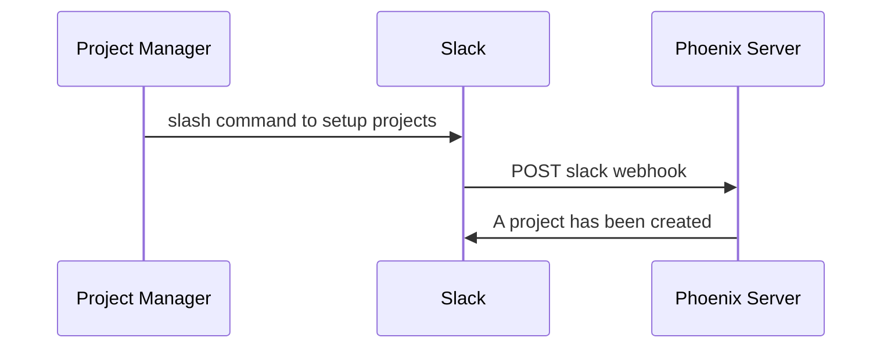
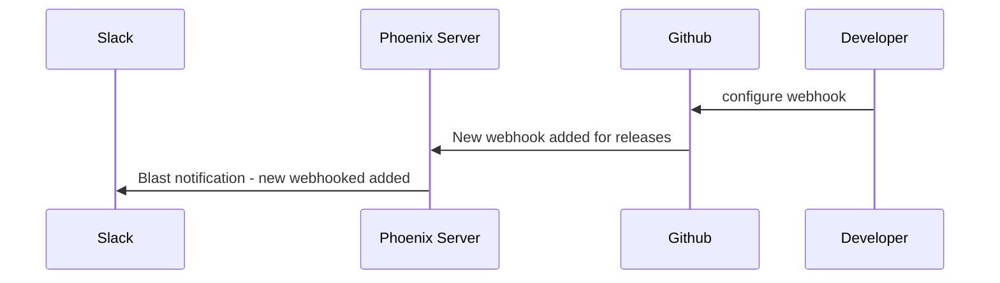
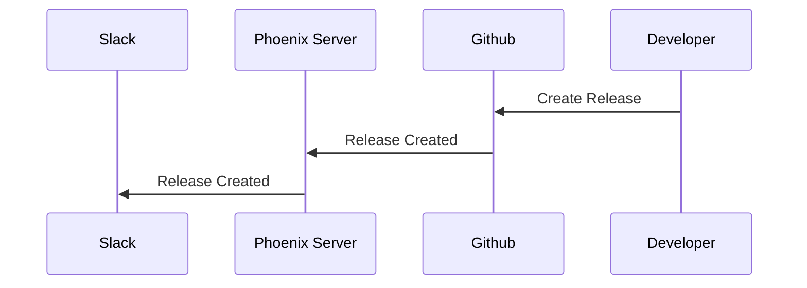

# Setup Slack Channel

```mermaid
sequenceDiagram
    participant Project Manager
    participant Slack
    participant Phoenix Server

    
    Project Manager->>Slack:  slash command to setup projects
    Slack->>Phoenix Server:  POST slack webhook
    Phoenix Server->>Slack: A project has been created

```

# Setup Github

```mermaid
sequenceDiagram
    participant Slack
    participant Phoenix Server
    participant Github
    participant Developer
    
    Developer->>Github: configure webhook
    Github->>Phoenix Server: New webhook added for releases
    Phoenix Server->>Slack: Blast notification - new webhooked added
```

# Create Release

```mermaid

sequenceDiagram
    participant Slack
    participant Phoenix Server
    participant Github
    participant Developer
    
    
    Developer->>Github: Create Release
    Github->>Phoenix Server: Release Created
    Phoenix Server->>Slack: Release Created

```
