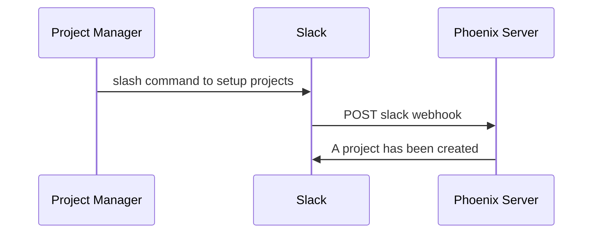
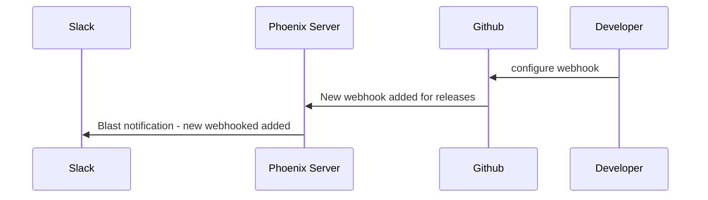
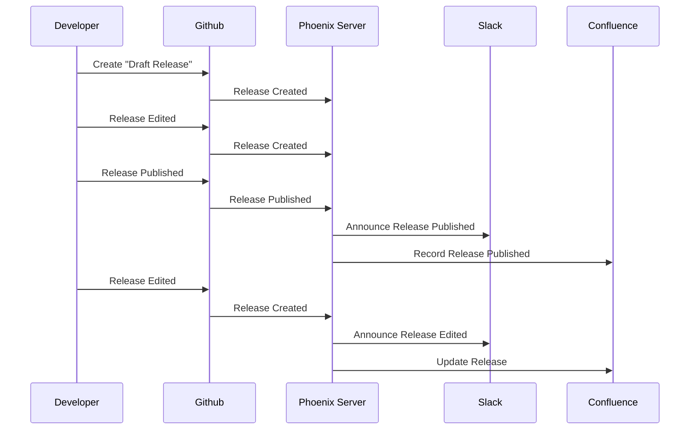

# Setup Slack Channel

```mermaid
sequenceDiagram
    participant Project Manager
    participant Slack
    participant Phoenix Server

    
    Project Manager->>Slack:  slash command to setup projects
    Slack->>Phoenix Server:  POST slack webhook
    Phoenix Server->>Slack: A project has been created

```

# Setup Github

```mermaid
sequenceDiagram
    participant Slack
    participant Phoenix Server
    participant Github
    participant Developer
    
    Developer->>Github: configure webhook
    Github->>Phoenix Server: New webhook added for releases
    Phoenix Server->>Slack: Blast notification - new webhooked added
```

# Release Life Cycle

```mermaid

sequenceDiagram
    participant Developer
    participant Github


    participant Phoenix Server
    participant Slack

    participant Confluence


    
    
    Developer->>Github: Create "Draft Release"
    Github->>Phoenix Server: Release Created

    Developer->>Github: Release Edited
    Github->>Phoenix Server: Release Created
    
    Developer->>Github: Release Published
    Github->>Phoenix Server: Release Published
    Phoenix Server->>Slack: Announce Release Published
    Phoenix Server->>Confluence: Record Release Published


    Developer->>Github: Release Edited
    Github->>Phoenix Server: Release Created
    Phoenix Server->>Slack: Announce Release Edited
    Phoenix Server->>Confluence: Update Release

```
