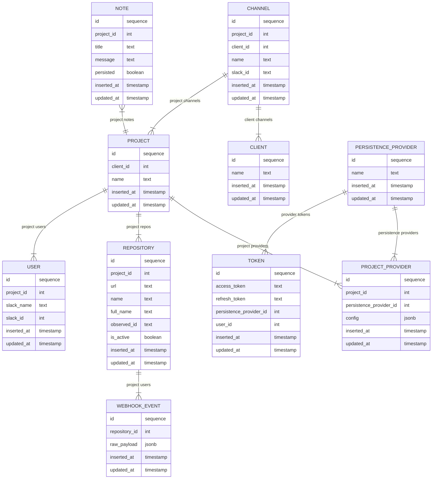

# Captains Log ERD

```mermaid
erDiagram

CHANNEL {
  id sequence
  project_id int
  client_id int
  name text
  slack_id text
  inserted_at timestamp
  updated_at timestamp
}

CHANNEL ||--|{ CLIENT: "client channels"
CHANNEL ||--|{ PROJECT: "project channels"

CLIENT {
    id sequence
    name text
    inserted_at timestamp
    updated_at timestamp
}

NOTE }|--|| PROJECT: "project notes"

NOTE {
    id sequence
    project_id int
    title text
    message text
    persisted boolean
    inserted_at timestamp
    updated_at timestamp
}

PERSISTENCE_PROVIDER {
    id sequence
    name text
    inserted_at timestamp
    updated_at timestamp
}

PROJECT ||--|{ PROJECT_PROVIDER: "project providers"
PERSISTENCE_PROVIDER ||--|{ PROJECT_PROVIDER: "persistence providers"

PROJECT_PROVIDER {
    id sequence
    project_id int
    persistence_provider_id int
    config jsonb
    inserted_at timestamp
    updated_at timestamp
}

PROJECT {
    id sequence
    client_id int
    name text
    inserted_at timestamp
    updated_at timestamp
}

PROJECT ||--|{ REPOSITORY: "project repos"

REPOSITORY {
    id sequence
    project_id int
    url text
    name text
    full_name text
    observed_id text
    is_active boolean
    inserted_at timestamp
    updated_at timestamp
}

PERSISTENCE_PROVIDER ||--|{ TOKEN: "provider tokens"

TOKEN {
    id sequence
    access_token text
    refresh_token text
    persistence_provider_id int
    user_id int
    inserted_at timestamp
    updated_at timestamp
}

PROJECT ||--|{ USER: "project users"

USER {
    id sequence
    project_id int
    slack_name text
    slack_id int
    inserted_at timestamp
    updated_at timestamp
}

REPOSITORY ||--|{ WEBHOOK_EVENT: "project users"

WEBHOOK_EVENT {
    id sequence
    repository_id int
    raw_payload jsonb
    inserted_at timestamp
    updated_at timestamp
}
```
